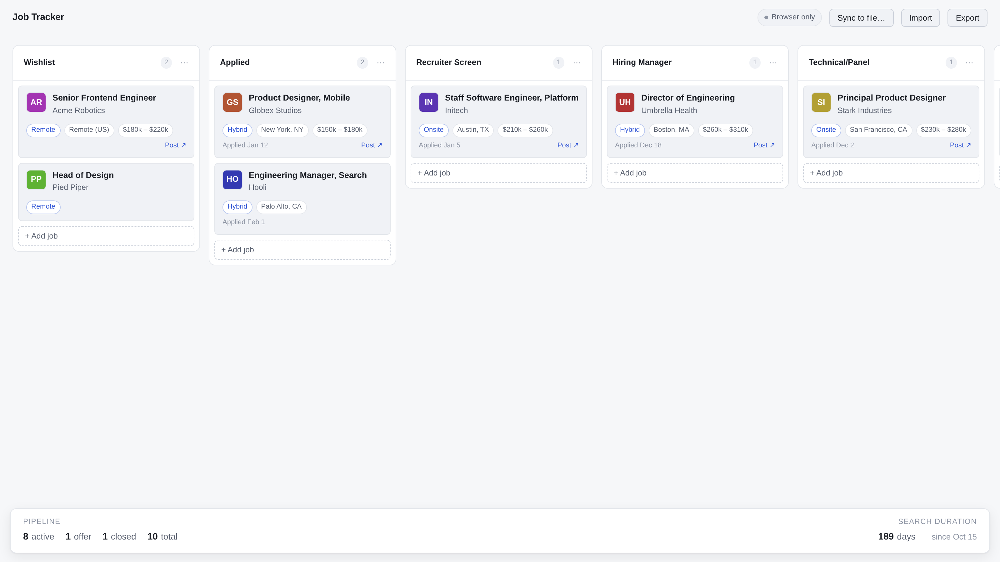
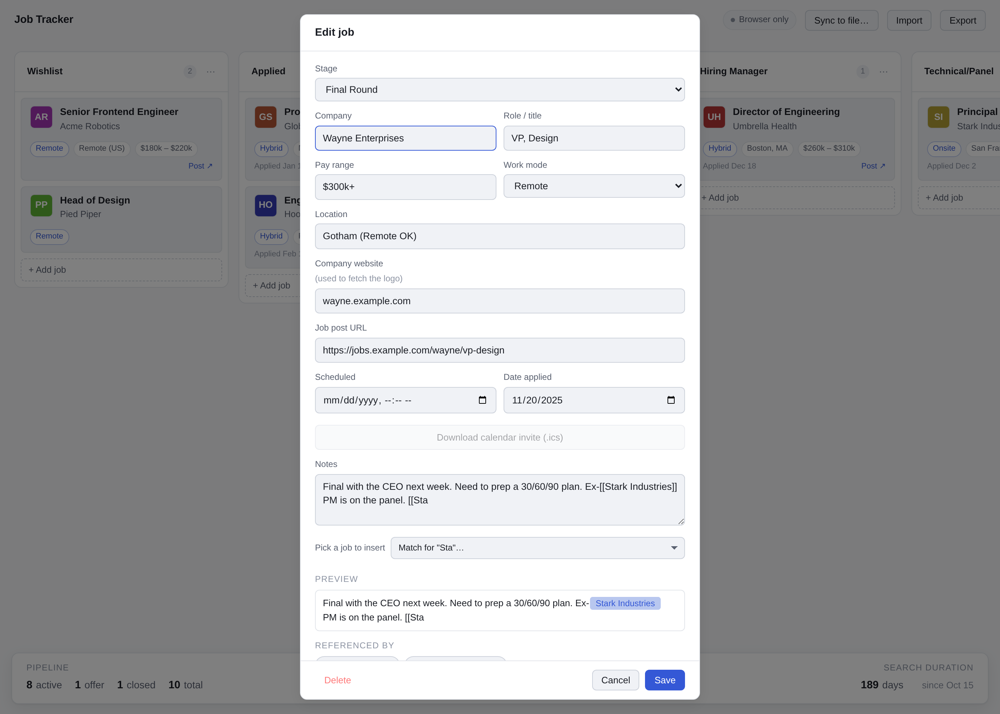

# Job Tracker

A lightweight kanban board for tracking job applications through the interview process. Runs entirely in your browser from a single HTML file — no build step, no server, no database, no account.

Your data lives on your machine. You can optionally sync it to a local `jobs.json` file that travels with you.

<picture>
  <source media="(prefers-color-scheme: dark)" srcset="screenshot-dark.png">
  
</picture>

## Features

- Drag-and-drop kanban board for organizing job applications
- Fully customizable columns: add, rename, reorder, and delete stages to match your process
- Core fields per job: company, role, pay range, location, work mode (remote/hybrid/onsite), company website, job post URL, date applied, a scheduled date & time for the next call/interview, and notes
- **Scheduled call/interview** — date and time slot for whatever's coming up next. Click the **.ics** button next to the field to download a calendar invite you can import into Apple Calendar, Google Calendar, or Outlook.
- **Schedule history per card** — each time you move a card to a new stage (or overwrite the scheduled time within a stage), the previous scheduled time is recorded in the card's history, grouped by the stage it belonged to. You can see a full timeline of past calls in the job modal.
- **Stage history tracking** — every stage transition records entry/exit timestamps. Powers the average-duration-per-stage stats.
- **Cross-reference jobs with `[[wikilinks]]`** — write `[[Company Name]]` in any card's notes and the tracker renders a clickable chip that jumps to that card. Backlinks appear automatically on the destination card. Same syntax works as a wikilink in Obsidian.
- **Stats bar** at the bottom of the board showing pipeline counts (active / offer / closed / total) and total days of search since your earliest application.
- Automatic company logos fetched from the company's domain (with a colored initials fallback)
- Three ways to persist your data:
  - **Auto-save to browser** — changes save instantly, no action needed
  - **Sync to local file** — pick a `jobs.json` once and the app writes every change to it (Chrome, Edge, Arc, Brave, or Opera)
  - **Import / export** — works in every browser; download or load a JSON snapshot anytime
- Works offline, loads instantly, respects your OS dark/light theme

## Getting started

### Option 1: Run locally (easiest)

1. Clone or download this repo
2. Double-click `index.html`
3. That's it — the board opens in your default browser

### Option 2: Host it on GitHub Pages

1. Push this folder to a GitHub repo
2. In the repo settings, enable GitHub Pages and point it at the branch/folder containing `index.html`
3. Open the URL GitHub gives you. The app is still 100% client-side — your data never leaves your browser.

## Saving your data to a local file

By default, the app auto-saves to your browser's `localStorage`. That survives tab closes and restarts, but it's tied to that specific browser on that specific machine.

For a portable setup, click **Sync to file…** in the header:

1. Pick or create a `jobs.json` anywhere on your drive (iCloud, Dropbox, a repo folder — wherever)
2. The app immediately writes your current board to that file, and keeps it in sync on every change
3. The status pill in the header turns green and shows the filename

You'll need to re-pick the file each time you reopen the page (browser security), but your data is already preserved in `localStorage` in the meantime, so nothing is lost.

If you're on Safari or Firefox, the auto-sync button is disabled but **Import** / **Export** still work.

## Default columns

The board ships with an eight-column interview flow:

Wishlist → Applied → Recruiter Screen → Hiring Manager → Technical/Panel → Final Round → Offer → Rejected/Closed

You can add, rename, reorder, and delete columns at any time:

- **Double-click** a column title to rename it
- Click the **⋯** menu on a column for rename, add-adjacent, and delete
- **Drag** a column header to reorder
- Click **+ Add column** at the far right

## Keyboard & mouse

- **Click a card** to edit a job
- **Drag a card** between columns (or within a column to reorder)
- **Esc** to close the edit dialog

## Bulk-importing from a Markdown table

If you already have a list of companies you're applying to, you can maintain it as a markdown table and import it into the board. A ready-to-edit template lives at [`companies.md`](./companies.md).

The table must have a header row, a separator row, and one row per job. The importer matches columns by header name — case-insensitive. Recognized columns:

- **Company** (required)
- **Role** (required)
- **Website** — used for the auto-fetched logo
- **Stage** — matched against your column titles; defaults to the first "Applied"-ish column
- **Location**
- **Pay**
- **Mode** — `Remote`, `Hybrid`, or `Onsite`
- **Applied** — `YYYY-MM-DD`
- **URL** — job post link
- **Notes**

Click **Import** in the tracker and pick the `.md` file. The importer merges into your existing board — it skips rows whose company+role already exists, so re-importing after edits is safe. The beauty of this is now you can do whatever you want with the `.md` file — visualize it, generate a story, up to you how creative you want to be.

## Linking jobs to each other

You can reference another job from inside any card's Notes using wiki-style links:

```
Recruiter pitched [[Wayne Enterprises]] as a similar role.
Leveraging the [[Wayne Enterprises|Wayne]] timeline to set a deadline.
```

- `[[Company Name]]` — resolves to the card whose **Company** field matches, case-insensitive.
- `[[Company Name|alias]]` — same, but renders with custom link text. Inside a markdown table cell, escape the pipe as `\|` so the table still parses.
- Unresolved links (no matching company yet) render as a dashed chip so you know it's a placeholder.
- **Live preview** — a Preview pane under the Notes field renders your notes with each `[[Company]]` turned into an inline highlighted chip you can click to jump to the target card. The Notes textarea itself (and the saved `jobs.json` / any exported markdown) keeps the raw `[[Company]]` syntax, so the same file is still a valid Obsidian vault.
- The destination card's modal automatically shows a **Referenced by** list of every card linking to it — two-way traversal without any extra bookkeeping.
- **Don't want to remember exact company names?** Type `[[` in the Notes field and a picker appears below it with every other job in your board. Keep typing to filter (`[[Way` narrows to "Wayne Enterprises"), then pick from the dropdown — the in-progress `[[partial` is replaced with a complete `[[Company Name]]` and the picker disappears until your next `[[`.

Because the syntax is plain `[[...]]`, the same file is a valid Obsidian vault — open `companies.md` in Obsidian and your links are real wikilinks there too.

<picture>
  <source media="(prefers-color-scheme: dark)" srcset="screenshot-modal-dark.png">
  
</picture>

## Data format

Exported and synced files are human-readable JSON:

```json
{
  "version": 1,
  "columns": [
    { "id": "c_abc", "title": "Applied", "cardIds": ["k_xyz"] }
  ],
  "cards": {
    "k_xyz": {
      "id": "k_xyz",
      "company": "Acme Inc.",
      "role": "Senior Product Designer",
      "pay": "$150k – $180k",
      "mode": "Remote",
      "location": "San Francisco, CA",
      "website": "acme.com",
      "url": "https://…",
      "dateApplied": "2026-04-18",
      "notes": "Recruiter Jane. Loop scheduled for next week.",
      "createdAt": 1713484800000,
      "updatedAt": 1713484800000
    }
  }
}
```

Back up or version-control this file however you like.

## Company logos

Fill in the **Company website** field (e.g. `acme.com`) and the app fetches that company's logo from Google's public favicon service and displays it on the card. If you only fill in the job post URL, the app will try to derive the company's domain from it — unless the URL is from a known job board (Greenhouse, Lever, Workday, LinkedIn, Indeed, etc.), in which case it falls back to a colored initials badge.

If a logo can't be fetched (no network, bad domain, Google is down), the card shows a colored badge with the company's initials. Your board keeps working either way.

## Privacy

Your job data stays on your machine — in your browser's `localStorage` and, if you opted into file sync, in the `jobs.json` you picked. It's never sent to a server.

The one exception is company logos: when a card has a `website` set, the browser loads `https://www.google.com/s2/favicons?domain=acme.com&sz=64`. That's a public unauthenticated request — no cookies or personal data — but it does tell Google that someone looked up that domain. If you'd rather not make any network requests at all, leave the Company website field blank and the app will use colored initials badges instead.

## License

MIT

## Author

Built by Harrison Wheeler.

- Website: [harrisonwheeler.com](http://www.harrisonwheeler.com)
- LinkedIn: [in/hmwheeler](http://linkedin.com/in/hmwheeler)
- Bluesky: [@hmwheele.bsky.social](https://bsky.app/profile/hmwheele.bsky.social)
